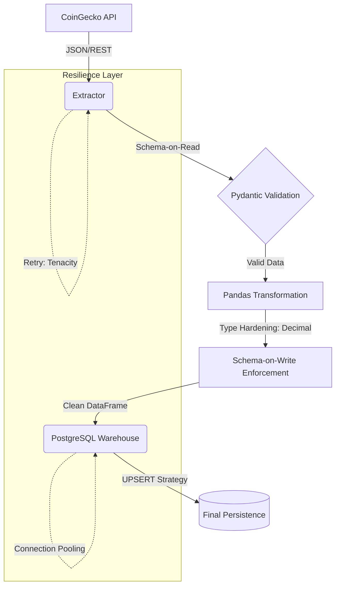

# De-Crypto Pipeline: Crypto Market ETL 🚀

**Data Engineering Portfolio - Jose Cortes**

Professional ETL pipeline designed to extract, transform, and load cryptocurrency market data from the CoinGecko API into a PostgreSQL data warehouse. This project demonstrates **Senior-level** implementation of data integrity, resilience, and idempotent persistence.

---

## 🏗️ Architecture & Data Flow

> **Note:** The diagram below requires a Mermaid-compatible viewer (like GitHub or VS Code Markdown Preview).



---

## ✨ Senior Engineering Highlights

*   **Financial Precision (Decimal Casting):** Unlike junior implementations using floats, this pipeline uses `decimal.Decimal` to ensure absolute mathematical precision in cryptocurrency values, avoiding rounding errors in low-cap assets.
*   **Idempotent Persistence (Upsert):** Implements `INSERT ... ON CONFLICT` logic, allowing the pipeline to be safely re-executed without duplicating historical records.
*   **Data Contracts (Dual-Validation):** 
    *   **Schema-on-Read:** Validates API payloads immediately upon extraction (Fail-Fast).
    *   **Schema-on-Write:** Enforces data structure integrity right before ingestion (Firewall).
*   **Enterprise Resilience:** Integrated `Tenacity` for **Exponential Backoff** handling of rate limits and SQLAlchemy **Connection Pooling** for optimized resource management.
*   **Atomic Transactions:** Uses managed database sessions (`engine.begin()`) to ensure "all-or-nothing" loads, maintaining perfect referential integrity.

---

## 🛠️ Technology Stack

*   **Language:** Python 3.11
*   **Libraries:** Pandas, SQLAlchemy, Pydantic, Tenacity, Requests.
*   **Database:** PostgreSQL 15 (Alpine)
*   **Infrastructure:** Docker & Docker Compose
*   **Quality:** Pytest, Black, Flake8.

---

## 🚀 Quick Start

1.  **Configure environment:**
    ```bash
    cp .env.example .env
    # Edit .env with your credentials
    ```

2.  **Deploy with Docker:**
    ```bash
    docker-compose up --build
    ```

---
*Developed by Jose Cortes - Senior Data Engineering Portfolio*
