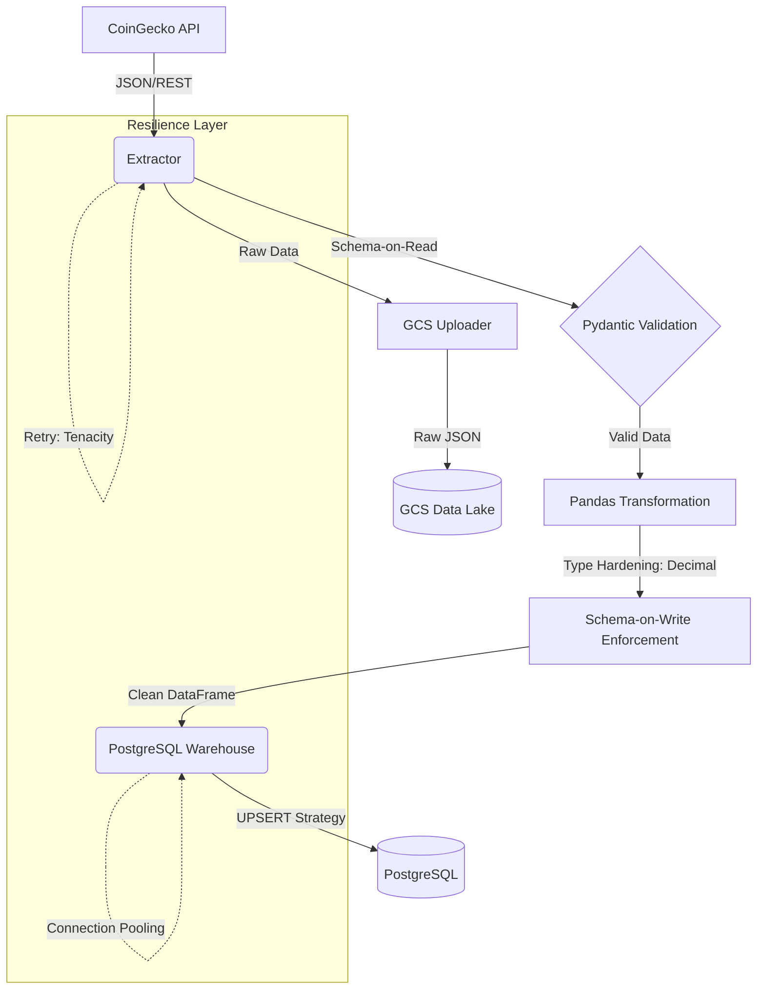

# De-Crypto Pipeline

## Overview
The De-Crypto Pipeline is a production-grade ETL system designed to extract cryptocurrency market data from the CoinGecko API and persist it into a dual-destination architecture: a Cloud Data Lake (Google Cloud Storage) for historical raw data and a PostgreSQL Data Warehouse for processed, analytics-ready information.

---

## Architecture & Data Flow



---

## Technical Documentation

Explore the detailed engineering behind this project:
*   [Architecture Decisions (ADRs)](docs/ARCHITECTURE_DECISIONS_EN.md): Justification for every technical choice (PostgreSQL, Upsert, Pydantic).
*   [Data Pipeline Flow (Deep Dive)](docs/DATA_PIPELINE_FLOW_EN.md): Step-by-step breakdown of the data lifecycle.
*   [Operations & Deployment Guide](docs/OPERATIONS_GUIDE_EN.md): Manual for running, maintaining, and scaling the system in production.

---

## Senior Engineering Highlights

*   **Dual-Persistence Strategy:** Implements a hybrid architecture by simultaneously streaming raw payloads to GCS (Data Lake) and transformed data to PostgreSQL (Data Warehouse), ensuring both data lineage and analytical readiness.
*   **Financial Precision:** Uses decimal.Decimal to ensure absolute mathematical precision in cryptocurrency values, avoiding rounding errors in low-cap assets.
*   **Idempotent Persistence:** Implements INSERT ... ON CONFLICT (Upsert) logic, allowing the pipeline to be safely re-executed without duplicating historical records.
*   **Data Contracts:** Dual-validation (Schema-on-Read and Schema-on-Write) using Pydantic ensures data structural integrity throughout the pipeline.
*   **Production Readiness:**
    *   **CI/CD Pipeline:** Automated testing and linting via GitHub Actions.
    *   **Observability:** Machine-readable JSON Logging and proactive Healthchecks.
    *   **Quality Firewall:** 100% compliance with Black (style) and Flake8 (linting), enforced via Git pre-commit hooks.

---

## Technology Stack

*   **Language:** Python 3.11
*   **Data Processing:** Pandas, SQLAlchemy, Pydantic
*   **Storage:** PostgreSQL 15, Google Cloud Storage (GCS)
*   **Infrastructure:** Docker, Docker Compose
*   **DataOps:** GitHub Actions, Pre-commit, Pytest-cov

---

## Quick Start

1.  **Configuration:**
    ```bash
    cp .env.example .env
    # Populate .env with required GCP and Database credentials
    ```

2.  **Deployment:**
    ```bash
    docker-compose up --build
    ```

---
*Developed as part of a Senior Data Engineering portfolio.*
