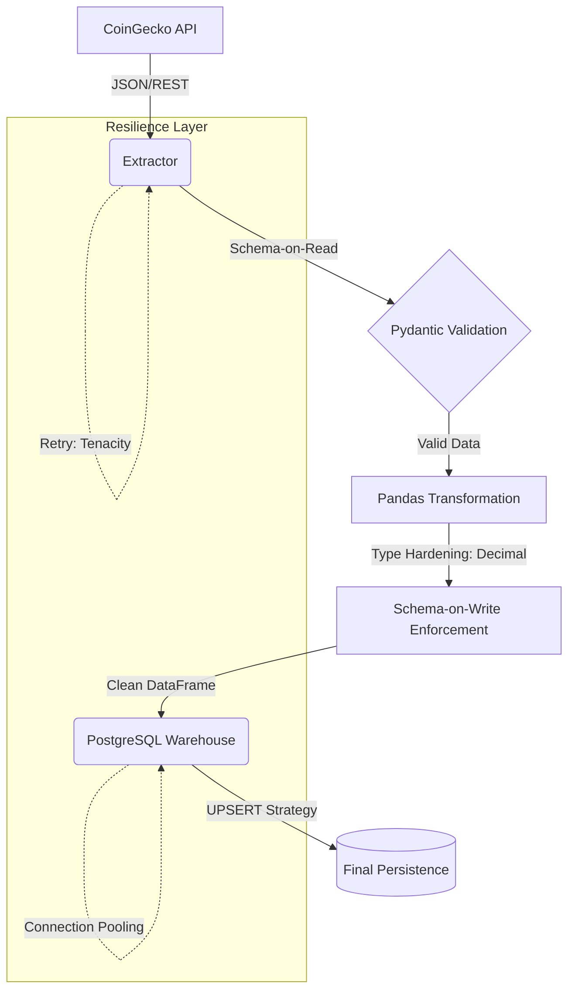

# De-Crypto Pipeline: Crypto Market ETL 🚀

**Data Engineering Portfolio - Jose Cortes**

Professional ETL pipeline designed to extract, transform, and load cryptocurrency market data from the CoinGecko API into a PostgreSQL data warehouse. This project demonstrates **Senior-level** implementation of data integrity, resilience, and idempotent persistence.

---

## 🏗️ Architecture & Data Flow

> **Note:** The diagram below requires a Mermaid-compatible viewer (like GitHub or VS Code Markdown Preview).



---

## 📚 Technical Documentation

Explore the detailed engineering behind this project:
*   [**Architecture Decisions (ADRs)**](docs/ARCHITECTURE_DECISIONS.md): Justification for every technical choice (PostgreSQL, Upsert, Pydantic).
*   [**Data Pipeline Flow (Deep Dive)**](docs/DATA_PIPELINE_FLOW.md): Step-by-step breakdown of the data lifecycle.
*   [**Operations & Deployment Guide**](docs/OPERATIONS_GUIDE.md): Manual for running, maintaining, and scaling the system in production.

---

## ✨ Senior Engineering Highlights

*   **Financial Precision (Decimal Casting):** Uses `decimal.Decimal` to ensure absolute mathematical precision in cryptocurrency values.
*   **Idempotent Persistence (Upsert):** Implements `INSERT ... ON CONFLICT` logic for safe re-executions.
*   **Data Contracts:** Dual-validation (Schema-on-Read and Schema-on-Write) using Pydantic.
*   **Production Readiness:**
    *   **CI/CD Pipeline:** Automated testing and linting via GitHub Actions.
    *   **Observability:** Machine-readable **JSON Logging** and proactive **Healthchecks**.
    *   **Quality Firewall:** 100% compliance with `Black` (style) and `Flake8` (linting).

---

## 🛠️ Technology Stack

*   **Language:** Python 3.11
*   **Libraries:** Pandas, SQLAlchemy, Pydantic, Tenacity, Requests.
*   **Database:** PostgreSQL 15 (Alpine)
*   **Infrastructure:** Docker & Docker Compose
*   **DataOps:** GitHub Actions, Pre-commit, Pytest-cov.

---

## 🚀 Quick Start

1.  **Configure environment:**
    ```bash
    cp .env.example .env
    # Edit .env with your credentials
    ```

2.  **Deploy with Docker:**
    ```bash
    docker-compose up --build
    ```

---
*Developed by Jose Cortes - Senior Data Engineering Portfolio*
